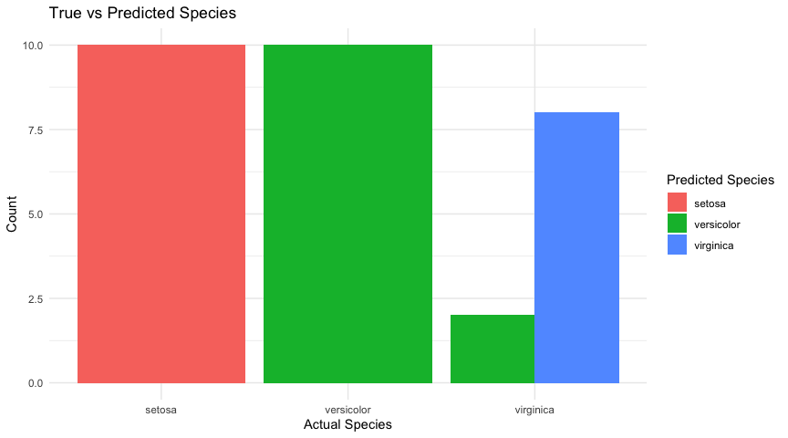

## Introduction

`parsnip` is a core package within the `tidymodels` ecosystem that
provides a unified interface for various machine learning models. It
abstracts away the complexities of different modeling libraries, making
it easier for users to switch between models and engines. <br><br> The
`tidymodels` framework is a collection of R packages for modeling and
machine learning using `tidyverse` principles. This collection of
packages offers a comprehensive set of tools for data preparation, model
training, and model evaluation and interpretation, which helps
streamline machine learning workflows for various modeling tasks.

### Core Packages within `tidymodels`

-   `recipes`: For data preprocessing and feature engineering.
-   `rsample`: For data splitting and resampling techniques.
-   `tune`: For hyperparameter tuning and model selection.
-   `parsnip`: For modeling interfaces that unify different machine
    learning libraries.
-   `yardstick`: For model evaluation metrics.

### Key features of the `parsnip` packages:

-   **Unified syntax:** A consistent syntax for specifying models,
    regardless of underlying library.
-   **Model specification:** Clear and concise model specification,
    including parameters and engine choices.
-   **Model fitting:** A simple interface for fitting models to data.
-   **Model prediction:** Consistent methods for making predictions with
    trained models.
-   **Model evaluation:** Integration with the yardstick package for
    model evaluation. <br> <br>

## Key `parsnip` Components

A problem with different modeling functions available in R that perform
the same mathematical operations is that they can have drastically
different interfaces and arguments. For example, making a random forest
model can vary widely depending on the packages being used.

``` r
# randomForest package
rf1 <- randomForest(Species ~ ., 
                    data = iris, 
                    ntree=50, 
                    norm.votes=FALSE)

# ranger package
rf2 <- ranger(Species ~ ., 
              data = iris, 
              probability = TRUE, 
              num.trees = 100)

# From sparklyr
rf_3 <- ml_random_forest(
              data = iris,
              type = "regression",
              probability_col = "probability",
              num_trees = 100)
```

The type, mode, and engines of each of these regressions is the same,
however, there is a lot of variability in the model syntax and argument
names, which can be a challenge to deal with. <br><br> To overcome these
syntactical complications. parsnip allows you to separate the definition
of a model from its evaluation and harmonize argument names.

## Key Components

The parsnip package helps you streamline your modeling process using
three main components:

1.  Model Family: You define what type of model you want to use such
    linear regression, logistic regression, Naive Bayes, or random
    forests (a complete list can be found
    [here](https://www.tidymodels.org/find/parsnip/)).

2.  Engine: This specifies the underlying library or algorithm used to
    implement the model (`lm` linear model is the default engine; call
    `show_engines()` to generate a list of possible engines for the type
    of model you have specified).

3.  Mode: Specifies the task to be completed by the model, such as
    “classificaiton” or “regression.”

Now that we have a general concept of how `parsnip` works and it’s
general features, we can create some simple models.

``` r
# load parsnip package by loading entire tidymodels suite 
library( tidymodels )

# or load only parsnip package explicitly
library( parsnip )

# loading example data from modeldata 'crickets' dataset
crickets <- modeldata::crickets
```

## Building a Model

Specify the type of model we want to use, define the engine, and save
the model to a variable. <br><br> *Example models* <br><br> **Linear
Regression**

``` r
lin_reg_model <- linear_reg() %>%
    set_engine("lm") # Linear model
```

**Logistic Regression**

``` r
log_reg_model <- logistic_reg() %>%
    set_engine("glm") # Generalized linear model
```

**Decision Tree**

``` r
tree_model <- decision_tree() %>%
    set_engine("rpart") # Recursive partitioning and regression trees
```

**Random Forest:**

``` r
rf_model <- rand_forest() %>%
    set_engine("ranger") # Fast implementation of random forests
```

### Load & Process Data, Specify & Fit Model

After specifying a model model has been set, it can be trained using the
`fit()` function. In this phase we will add data to our model. For
simplicity, we will split the `iris` dataset into training and testing
sets, and create a simple preprocessing “recipe” and save it into a
workflow with our model. The tidymodels package has robust features for
data pre-processing in the
[recipes](https://recipes.tidymodels.org/reference/recipe.html?q=parsnip#modeling)
package that can also help streamline your analysis.

``` r
# load & preview data
data(iris)
glimpse(iris)
```

    ## Rows: 150
    ## Columns: 5
    ## $ Sepal.Length <dbl> 5.1, 4.9, 4.7, 4.6, 5.0, 5.4, 4.6, 5.0, 4.4, 4.9, 5.4, 4.…
    ## $ Sepal.Width  <dbl> 3.5, 3.0, 3.2, 3.1, 3.6, 3.9, 3.4, 3.4, 2.9, 3.1, 3.7, 3.…
    ## $ Petal.Length <dbl> 1.4, 1.4, 1.3, 1.5, 1.4, 1.7, 1.4, 1.5, 1.4, 1.5, 1.5, 1.…
    ## $ Petal.Width  <dbl> 0.2, 0.2, 0.2, 0.2, 0.2, 0.4, 0.3, 0.2, 0.2, 0.1, 0.2, 0.…
    ## $ Species      <fct> setosa, setosa, setosa, setosa, setosa, setosa, setosa, s…

``` r
# set a seed for reproducibility
set.seed(123)

# create a train/test split
iris_split <- initial_split(iris, prop = 0.8, strat = "Species")
iris_train <- training(iris_split)
iris_test <- testing(iris_split)

# define the decision tree model
tree_model <- decision_tree() %>%
  set_engine("rpart") %>%
  set_mode("classification")

# create a recipe
iris_recipe <- recipe(Species ~ ., data = iris_train) %>%
  step_normalize(all_predictors())  # normalizing predictors

# create a workflow
iris_workflow <- workflow() %>%
  add_recipe(iris_recipe) %>%
  add_model(tree_model)

# fit the model
iris_fit <- iris_workflow %>%
  fit(data = iris_train)

# Check the fitted model
iris_fit
```

    ## ══ Workflow [trained] ══════════════════════════════════════════════════════════
    ## Preprocessor: Recipe
    ## Model: decision_tree()
    ## 
    ## ── Preprocessor ────────────────────────────────────────────────────────────────
    ## 1 Recipe Step
    ## 
    ## • step_normalize()
    ## 
    ## ── Model ───────────────────────────────────────────────────────────────────────
    ## n= 120 
    ## 
    ## node), split, n, loss, yval, (yprob)
    ##       * denotes terminal node
    ## 
    ## 1) root 120 80 setosa (0.33333333 0.33333333 0.33333333)  
    ##   2) Petal.Length< -0.739538 40  0 setosa (1.00000000 0.00000000 0.00000000) *
    ##   3) Petal.Length>=-0.739538 80 40 versicolor (0.00000000 0.50000000 0.50000000)  
    ##     6) Petal.Width< 0.6882871 42  3 versicolor (0.00000000 0.92857143 0.07142857) *
    ##     7) Petal.Width>=0.6882871 38  1 virginica (0.00000000 0.02631579 0.97368421) *

## Make Predictions

Once the model is fitted, you can make predictions by calling the
`predict()` function and `bind_cols()` to bind the predicted data with
the test data.

``` r
# Make predictions
predictions <- iris_fit %>%
  predict(new_data = iris_test) %>%
  bind_cols(iris_test)

# View the predictions
head(predictions)
```

    ## # A tibble: 6 × 6
    ##   .pred_class Sepal.Length Sepal.Width Petal.Length Petal.Width Species
    ##   <fct>              <dbl>       <dbl>        <dbl>       <dbl> <fct>  
    ## 1 setosa               5.1         3.5          1.4         0.2 setosa 
    ## 2 setosa               4.9         3            1.4         0.2 setosa 
    ## 3 setosa               5.4         3.9          1.7         0.4 setosa 
    ## 4 setosa               5.7         4.4          1.5         0.4 setosa 
    ## 5 setosa               4.6         3.6          1           0.2 setosa 
    ## 6 setosa               5.5         4.2          1.4         0.2 setosa

## Evaluate Predictions

You can assess model performance by comparing predictions to actual
values using the `metrics()` function from the `yardstick` package in
the tidymodels suite. This function estimates one or more common
performance estimates depending on the class of the `truth` argument
(Species in this case). The table below estimates ~90% accuracy for our
prediction.

``` r
# calculate accuracy
accuracy_result <- predictions %>%
  metrics(truth = Species, estimate = .pred_class)

# view result
accuracy_result
```

    ## # A tibble: 2 × 3
    ##   .metric  .estimator .estimate
    ##   <chr>    <chr>          <dbl>
    ## 1 accuracy multiclass     0.933
    ## 2 kap      multiclass     0.9

``` r
# graph
ggplot(predictions, aes(x = Species, fill = .pred_class)) +
  geom_bar(position = "dodge") +
  labs(title = "True vs Predicted Species",
       x = "Actual Species",
       y = "Count",
       fill = "Predicted Species") +
  theme_minimal()
```



## Conclusions

The `parsnip` package offers a flexible and powerful way to handle
models in R. It abstracts away many details of model fitting and allows
you to focus on your analysis. Whether you’re using it for linear
models, tree-based methods, or others, the consistent syntax helps
streamline your modeling workflow.

### Works Cited

This code through references and cites the following sources:

-   [parsnip
    Documentation](https://cran.r-project.org/web/packages/parsnip/parsnip.pdf)
-   [tidymodels Website](https://www.tidymodels.org/)
-   [recipes
    Documentation](https://cran.r-project.org/web/packages/recipes/recipes.pdf)
